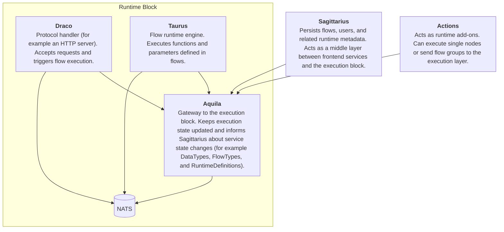
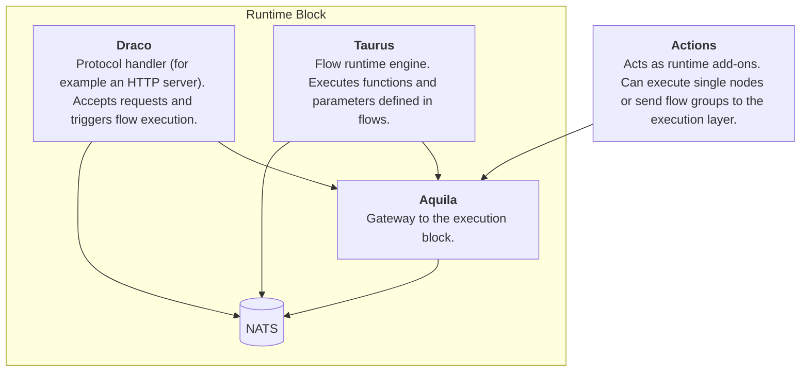

Use this guide to understand Aquila's runtime architecture and choose the right development mode.

## Requirements

To contribute to Aquila, you should be familiar with:

- **[Rust](https://rust-lang.org/)**
- **[gRPC](https://grpc.io)**
- **[NATS](https://nats.io)**

---

## Runtime Infrastructure Overview

For a working runtime, the following services are required:

- Aquila acts as the gateway between the IDE layer and the execution layer.
  - Keeps runtime definitions up to date
  - Keeps the latest flows available in the runtime
  - Handles authentication and node execution for actions
- Draco is the runtime flow trigger (for example HTTP requests and cron jobs)
- Taurus is the runtime execution engine
- Actions are Taurus add-ons that extend runtime functionality
- Sagittarius persists definitions and flows
- NATS provides queueing for flow execution and KV storage for flows

## Static vs Dynamic Mode

Static and dynamic are runtime-level operating modes, not Aquila-only concepts.
In static mode, the runtime is standalone and does not depend on Sagittarius.
In dynamic mode, Aquila maintains an active connection to Sagittarius to keep runtime data synchronized.

### Dynamic

In dynamic mode, the runtime follows the first diagram above: Aquila stays connected to Sagittarius.

Reasons to run dynamic mode:
- Flows are updated frequently and should be synchronized automatically
- You expect continuous growth in flow count

### Static

In static mode, Sagittarius is not part of the runtime path. Flows and runtime configuration are loaded from local files.

Reasons to run static mode:
- Runtime needs to be standalone
- No flow updates are needed anymore
- Infrastructure resources are constrained and should be dedicated to execution

Infrastructure for static mode:

> In static mode, flow data and service authorization are loaded from local files (for example `FLOW_FALLBACK_PATH` and `SERVICE_CONFIG_PATH`) before runtime execution starts.
